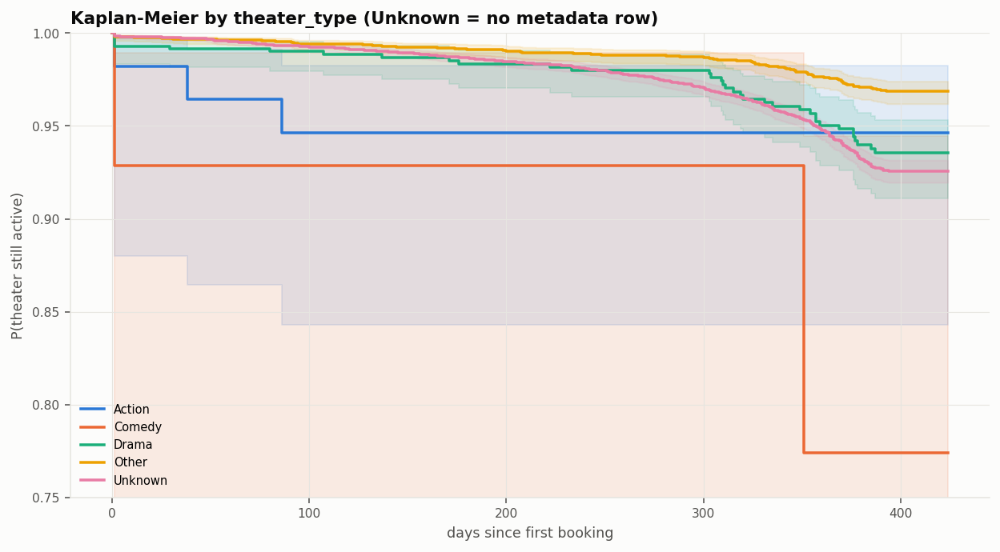

# Forecasting Cinema Audience Demand

*Time Series term project. The structure follows the "Forecasting L&T Spare Parts" case (pattern → seasonal index → ANOVA → regression → exponential smoothing → stationarity & ARIMA → combining models → model comparison). Each method is justified for cinema data first; comparisons with L&T are short "cf. L&T" notes.*

All numbers come from `python run_pipeline.py --phase all`. Detailed tables are in `outputs/excel/` and figures in `outputs/figures/`.

---

## 1. Introduction

A cinema ticketing business sells through two systems: **booknow** (online bookings) and **cinePOS** (box-office sales), across about 13,500 theaters. Screens, staff and concessions are planned days ahead, so the business needs a **daily forecast of total tickets**. Demand has a trend, a strong weekly cycle (people go to the cinema at weekends) and one-off events (releases, festivals, December holidays).

**Research question.** Can daily cinema ticket demand be forecast accurately with trend/seasonal regression, exponential smoothing and ARIMA-family models, and does combining their forecasts improve out-of-sample accuracy?

### 1a. How models are selected (decided before any test result was seen)

| Step | Data | Role |
|---|---|---|
| Estimation | train: 29 Jan – 31 Dec 2023 | fit parameters, including every preprocessing parameter |
| **Selection (primary)** | validation: Jan 2024 | multi-step forecast accuracy (MAPE, RMSE, MAE) ranks the models and picks the combination members and method |
| Diagnostics (secondary) | train residuals | Ljung–Box, normality: used to spot a mis-specified model, not to rank models |
| **Confirmation only** | test: Feb 2024 | models refit on train + validation with the same procedure, then scored once |

The combination members (SARIMAX_no_lead, SARIMA, Holt-Winters multiplicative, MLR_no_lead) and the final method (Bates–Granger) were fixed on validation. **No parameter, weight, preprocessing step or selection decision was changed after the February results were seen.**

*Disclosure:* the trend + weekday-dummy regression (§6) and the classical tables in §4–5 and §12 were added **after** the test results existed, to mirror the L&T case. They are reported as descriptive benchmarks only and played no part in choosing members or the final method.

## 2. Data

| Item | Value |
|---|---|
| Series | daily `total_demand` = booknow booked + cinePOS sold − tickets recorded in both systems |
| Deduplication | 11,335 tickets were removed as **exact record matches**: the same physical theater (linked through `movie_theater_id_relation.csv`), the same show hour, booking hour and ticket count. Matching is one-to-one (N identical rows on one side can match at most N on the other). Non-exact near-matches are kept as distinct bookings. |
| Period modelled | 29 Jan 2023 – 28 Feb 2024 (396 days). The first 28 days are dropped because bookings made before the data start are missing. |
| Level | mean 20,759/day, median 15,442, min 5,487, max 167,804 |
| Data issue | 84-day booknow outage (Jul–Oct 2023): booknow is set to 0 and flagged `booknow_missing` |
| Split | train 337 days · validation 31 · test 28 (see §1a) |

## 3. Pattern

- **Gradual trend vs. December event.** These are two different things, and keeping them apart explains the numbers:
  - The *gradual* trend, estimated on training data with December adjusted, is **+3.0% per month** (§6). That is about +39% across 2023.
  - **December 2023** is a temporary surge of about 2.5× (§3a).
  - After December, demand **settles about 70% above** the 2023 level (Jan–Feb 2024). This is a level shift that lies outside the training window, so no model trained on 2023 can fully anticipate it.
  - The STL trend's +120% over the whole sample mixes all three effects.
- **Weekly seasonality.** The periodogram peaks at 6.95 days (27% of spectral power) and STL seasonal strength is F_s = 0.76.
- **Scale.** The weekly swing grows with the level. The absolute additive residual correlates with the level at r = 0.68. A multiplicative decomposition leaves lower residual variance than the additive one (9.38e7 vs 1.14e8 tickets²). This **supports a log transform and a multiplicative seasonal specification**, so the ARIMA-family and regression models use log demand.
- **Outliers.** Days are flagged with a robust z-score (median/MAD) of the log-scale STL remainder: |z| > 3.5 is flagged, |z| > 7 is extreme. That gives **61 flagged days (25 extreme)**. They are kept, not removed. They cluster on Thursdays/Fridays, Christmas and New Year's Eve, which is **consistent with event-driven demand**. Release dates are not in the data, so this cannot be verified directly. Spot checks (e.g. 27–28 Feb 2023: normal theater counts and ticket sizes) found no sign of load errors.

### 3a. December adjustment

The training window ends inside the December surge. If univariate models (which cannot take a dummy variable) are fitted on raw data, they carry the December level into January. Their validation MAPE is then 72–301% instead of 31–58% (the one exception is noted below) (`model_inference_tables.xlsx → sensitivity_no_dec_adjust`). The surge is therefore estimated and divided out:

log y_t = β₀ + β₁·trend_t + Σ weekday dummies + β_h·holiday_t + **δ·Dec2023_t** + e_t, estimated by OLS with HAC(7) standard errors. The multiplier is **exp(δ̂) = 2.50** (p = 1e-08).

- δ is estimated on the **training data only** (`src/models.py::dec_multiplier`). For the test refit it is re-estimated on train + January. February never enters.
- December observations of the univariate models' training target are divided by 2.50. Their forecasts are therefore for "normal" (non-surge) conditions.
- Models with regressors (MLR, SARIMAX) use the unadjusted series with the December dummy instead.
- One exception: the trend + dummy regression does slightly *better* without the adjustment (validation MAPE 20.8% vs 23.1%). Its linear trend, fitted through December, happens to pick up the post-December level. The adjusted version is reported, for consistency with the other univariate models.

## 4. Seasonal index (weekday)

Cinema attendance differs sharply by weekday, so the season is the day of the week (m = 7). The index is:

**Seasonal index_d = (mean demand on weekday d) ÷ (mean of the seven weekday means) × 100**, so the seven indices average 100.

Three variants are computed on training data (Feb–Dec 2023, full months only):
1. **Simple average:** weekday means over all months. This is the method on the L&T slide, with months in place of years as the columns.
2. **Simple average excluding December:** the same, with the surge month removed.
3. **Ratio to centred 7-day moving average:** each day ÷ its centred 7-day mean, averaged by weekday. The moving average removes the trend before averaging.

| Weekday | Feb | Mar | … | Nov | Dec | Average | **Index (1)** | Index (2) excl. Dec | Index (3) ratio-to-MA |
|---|---:|---:|---|---:|---:|---:|---:|---:|---:|
| Mon | 23,283 | 14,581 | … | 16,477 | 27,472 | 14,926 | **76.0** | 83.8 | 81.9 |
| Tue | 11,358 | 11,036 | … | 10,991 | 29,147 | 11,309 | **57.6** | 58.4 | 57.9 |
| Wed | 6,482 | 12,075 | … | 16,398 | 36,564 | 12,803 | **65.2** | 63.9 | 63.1 |
| Thu | 7,479 | 15,409 | … | 17,905 | 51,903 | 17,012 | **86.6** | 82.9 | 82.8 |
| Fri | 12,403 | 13,756 | … | 15,108 | 63,317 | 17,549 | **89.3** | 79.5 | 81.4 |
| Sat | 9,107 | 35,018 | … | 33,896 | 91,328 | 33,623 | **171.2** | 170.7 | 171.4 |
| Sun | 22,616 | 28,586 | … | 38,168 | 70,942 | 30,287 | **154.2** | 160.7 | 161.5 |

Saturday runs at about 1.7× an average day and Tuesday at about 0.58×. The simple-average index is distorted by December (Friday: 89 with December, 80 without). The trend-free ratio-to-MA index agrees with the ex-December version, so variants (2) and (3) are the reliable ones. Full table: `classical_analysis.xlsx → seasonal_index`.

## 5. ANOVA: is the weekday effect significant?

| Analysis (train) | Source | SS | df | MS | F | p-value | F crit (5%) |
|---|---|---:|---:|---:|---:|---:|---:|
| One-way, tickets | Between weekdays | 2.40e10 | 6 | 4.00e9 | **14.70** | <0.001 | 2.13 |
| | Within | 8.98e10 | 330 | 2.72e8 | | | |
| One-way, log tickets | Between weekdays | 51.8 | 6 | 8.64 | **39.67** | <0.001 | 2.13 |
| Two-way, log (weekday + month) | Between weekdays | 49.7 | 6 | 8.29 | **78.30** | <0.001 | 2.13 |
| | Between months | 38.1 | 11 | 3.46 | 32.69 | <0.001 | 1.82 |
| Kruskal–Wallis (rank-based) | Between weekdays | | 6 | | χ² = 155.5 | <0.001 | 12.59 |

- The weekday effect is significant in every specification.
- Adding month as a second factor raises the weekday F from 39.7 to 78.3. The weekday effect itself has not doubled. What has happened is that month-to-month level changes are removed from the unexplained variance (MS_within), so the weekday differences stand out more clearly against the remaining noise.
- The Kruskal–Wallis test, which does not assume normality, also finds significant weekday differences. That gives non-parametric support for weekly seasonality.

*cf. L&T:* there, a one-way ANOVA across months was not significant (p = 0.376) because the trend inflated the within-group variance. Seasonality only appeared once the regression included a trend. Here the weekly effect is strong enough to show even without that correction.

## 6. Regression: trend + seasonal dummies

This is the simplest model consistent with §3–5: a gradual trend plus a fixed weekday pattern.

`log demand = const + trend (months) + weekday dummies (Monday = base)`. OLS on December-adjusted training data (§3a), HAC(7) standard errors.

| Term | Full: coef | p | Reduced: coef | p | Multiplier (reduced) |
|---|---:|---:|---:|---:|---:|
| Intercept | 9.300 | <0.001 | 9.312 | <0.001 | |
| Trend (per month) | 0.030 | 0.003 | 0.030 | 0.003 | **+3.0%/month** |
| Tue | −0.324 | <0.001 | −0.336 | <0.001 | 0.72× Monday |
| Wed | −0.232 | 0.001 | −0.243 | <0.001 | 0.78× |
| Thu | 0.038 | 0.615 | — | | dropped |
| Fri | −0.003 | 0.966 | — | | dropped |
| Sat | 0.724 | <0.001 | 0.712 | <0.001 | **2.04×** |
| Sun | 0.676 | <0.001 | 0.665 | <0.001 | 1.94× |

| Regression statistics | Full | Reduced (p < 0.05) |
|---|---:|---:|
| Multiple R / R² / adj. R² | 0.769 / 0.592 / 0.583 | 0.769 / 0.591 / 0.585 |
| ANOVA F (df) | 68.1 (7, 329) | 95.7 (5, 331) |
| Validation MAPE / RMSE | 23.1% / 10,147 | 23.2% / 10,145 |

- Thursday and Friday do not differ from Monday, so the reduced model drops them with no loss of fit (cf. L&T, where the reduced model kept only the trend and two months).
- The model has no lags, so its residuals are strongly autocorrelated (Ljung–Box Q(18) p < 0.001). Its standard errors are HAC for that reason, and it is a **baseline**, not a final model.

## 7. Simple exponential smoothing

SES is the no-trend, no-season benchmark.

- α = **0.036** (p = 0.035): a very long memory, so the forecast is a flat line at the smoothed level.
- In-sample MAPE is 52.8%, and Ljung–Box Q(18) = 658 (p < 0.001): the residuals keep the whole weekly cycle.
- Validation MAPE is 37.6%. Any useful model has to beat this.

## 8. Stationarity: ACF/PACF and Augmented Dickey–Fuller

ARIMA models need a stationary series, so the unit-root tests are run on log demand. ADF (null: unit root) is paired with KPSS (null: stationary) because a single test is unreliable when the series has breaks.

| Series (log demand) | ADF stat | ADF p | KPSS p | Conclusion |
|---|---:|---:|---:|---|
| level | −2.07 | 0.257 | ≤0.01 | **non-stationary** (both tests agree) |
| Δ1 (first difference) | −6.37 | <0.001 | 0.047 | borderline (KPSS still rejects) |
| Δ7 (seasonal difference) | −6.32 | <0.001 | ≥0.10 | **stationary** |
| Δ1Δ7 | −7.66 | <0.001 | ≥0.10 | stationary, but ACF shows over-differencing |

After a first difference, the ACF still has spikes of about 0.6–0.7 at lags 7, 14, … 42. That points to a seasonal unit root, so the chosen difference is **D = 1, d = 0**. *cf. L&T:* a first difference was enough there (ADF p 0.31 → 0.012).

## 9. Holt-Winters

Holt-Winters adds a trend and a seasonal component to SES. Both the additive and multiplicative forms are fitted, because §3 suggests the seasonal amplitude grows with the level.

| | Additive | Multiplicative |
|---|---:|---:|
| α (level) | 0.203 | 0.317 |
| β (trend) | 0.001 | 0.000 |
| γ (season) | 0.302 | 0.423 |
| In-sample MAPE | 26.7% | 24.8% |
| Ljung–Box Q(18) sig. | <0.001 | **0.228** (no remaining autocorrelation) |
| Validation MAPE | 33.6% | 30.5% |

β ≈ 0, so the trend component changes very slowly: the slope estimated at the start is barely revised (cf. L&T, where γ_trend ≈ 0 as well). The multiplicative form leaves white-noise residuals but reacts strongly to one-day spikes. After 22 Dec 2023 (157k tickets) its fitted value for 23 Dec is 278k, which inflates its in-sample MaxAE.

## 10. ARIMA

ARIMA models capture the day-to-day autocorrelation that regression and smoothing leave behind. Candidates came from an automatic search and from reading the ACF/PACF of the stationary series (§8).

| Candidate | How chosen | Ljung–Box Q(18) p | Validation MAPE | Validation RMSE |
|---|---|---:|---:|---:|
| ARIMA(7,1,1) + drift | `auto_arima`, non-seasonal, KPSS → d = 1 | 0.001 | 45.9% | 18,456 |
| AR(7) / ARMA(7,3) on Δ7 log | AIC grid on the stationary series | <0.001 | 48.1% / 57.6% | 17,854 / 18,358 |
| **SARIMA(1,0,0)(1,1,1)₇** | ACF/PACF of Δ7 log (AR(1) + seasonal MA(1)), refined by AIC grid | 0.053 | **31.1%** | 12,755 |
| SARIMAX(1,1,1)(1,0,0)₇ + weekday / holiday / December regressors | AIC grid | 0.479 | 37.3% | **9,284** |

**AIC was used only within each family** (e.g. to rank the 72 SARIMA grid fits; top 5 in `classical_analysis.xlsx → arima_candidates`). It is not compared across families: the families use different differencing (d = 1 vs D = 1), different effective samples and, for SARIMAX, a different target (unadjusted demand with a December dummy). The likelihoods are therefore not comparable. **The choice between families is made on validation accuracy.**

On that basis the seasonal models clearly beat the non-seasonal auto-ARIMA. auto-ARIMA needs 7 AR lags to imitate the weekly cycle and still leaves autocorrelation. SARIMA coefficients: φ₁ = 0.44, Φ₁ = 0.31, Θ₁ = −0.86 (all p < 0.001). *cf. L&T:* the auto suggestion ARIMA(0,0,1) was also overruled there, because the ADF test showed the series needed differencing.

## 11. Combining models

Combining forecasts makes sense here because the members capture different structure: SARIMAX uses regressors, SARIMA uses seasonal autocorrelation, Holt-Winters adapts its level and season, and MLR uses lags. Members and weights were estimated on validation (§1a).

| Method | Weights (SARIMAX / SARIMA / HW-mult / MLR) | Intercept | Test RMSE | Test MAPE |
|---|---|---:|---:|---:|
| Regression with intercept (cf. L&T slide 28) | 1.04 / 1.70 / −1.82 / −0.71 | 11,873 | 24,986 | 46.1% |
| Regression without intercept, sum-to-one (cf. L&T slides 29–30) | 0.86 / 1.84 / −1.04 / −0.66 | 0 | 8,617 | 18.0% |
| **Bates–Granger (inverse-MSE)**, pre-registered choice | 0.40 / 0.21 / 0.15 / 0.24 | 0 | 4,800 | 14.1% |
| Simple average | 0.25 each | 0 | 4,601 | **13.8%** |
| *Best single model: SARIMAX_no_lead* | — | — | **4,584** | 15.2% |

**Diebold–Mariano tests** (each combination vs SARIMAX_no_lead, which had the lowest validation RMSE). Squared-error loss, Harvey–Leybourne–Newbold small-sample correction, two-sided, horizon h = 1 on the 28 daily test errors:

| Combination | DM statistic | p-value | Verdict (5%) |
|---|---:|---:|---|
| Simple average | 0.040 | 0.968 | no difference |
| Bates–Granger | 0.375 | 0.710 | no difference |
| Regression, sum-to-one | 1.643 | 0.112 | no difference |
| Regression with intercept | 3.020 | 0.005 | SARIMAX significantly better |

- **Regression weights do not work here.** The member forecasts are highly collinear (VIF up to 84), so the regression weights take opposite signs and extrapolate badly out of sample. *cf. L&T:* the regression weights were fitted and scored on the same 48 months (R² = 0.987), so this problem did not show.
- **No single forecast wins on every metric.** SARIMAX has the lowest test RMSE, the simple average has the lowest test MAPE, and Bates–Granger sits between them. The DM tests cannot separate these three.

## 12. Model comparison

The fit statistics use the same set as the L&T/SPSS slides and are computed on the **training** window, on the ticket scale. Stationary R² here is measured against a seasonal random walk (same weekday last week). That is close to SPSS's definition but not identical.

These in-sample statistics are **descriptive**. Selection used validation (§1a), and test is confirmation. The principal models are shown below; **all 13 are in Appendix A**.

| | Trend+dummy Reg | SES | HW mult. | ARIMA(7,1,1) | SARIMA | SARIMAX | Combined (B–G) |
|---|---:|---:|---:|---:|---:|---:|---:|
| Stationary R² | 0.228 | −0.211 | −0.650 | −0.090 | 0.029 | 0.103 | — |
| R² | 0.591 | 0.359 | 0.132 | 0.426 | 0.488 | 0.528 | — |
| RMSE | 11,749 | 14,715 | 17,122 | 13,954 | 13,244 | 12,652 | — |
| MAPE (%) | 24.4 | 52.8 | 24.8 | 23.9 | 20.5 | 20.3 | — |
| MaxAPE (%) | 368 | 256 | 426 | 326 | 327 | 321 | — |
| MAE | 5,346 | 9,128 | 5,581 | 5,261 | 4,794 | 4,689 | — |
| MaxAE | 118,939 | 121,251 | 221,875 | 181,832 | 160,762 | 142,174 | — |
| Normalised BIC | 18.88 | 19.23 | 19.70 | 19.26 | 19.05 | 19.12 | — |
| Ljung–Box Q(18) sig. | <0.001 | <0.001 | 0.228 | 0.001 | 0.053 | 0.479 | — |
| **Validation MAPE (Jan)** | **23.1** | 37.6 | 30.5 | 45.9 | 31.1 | 37.3 | — |
| **Test RMSE (Feb)** | 6,642 | 13,584 | 7,439 | 7,859 | 5,442 | **4,584** | 4,800 |
| **Test MAPE (Feb)** | 15.4 | 46.4 | 23.3 | 27.9 | 14.3 | 15.2 | 14.1 |

## 13. Conclusions

1. **Weekly seasonality dominates.** Saturday runs at about 2× Monday and Tuesday at about 0.7×. The seasonal index, ANOVA (weekday F = 14.7 one-way, 78.3 with month controlled) and the dummy regression all agree. The seasonal amplitude grows with the level, which supports log-scale, multiplicative-seasonal models.
2. **Gradual trend vs. events.** The underlying trend is modest (+3%/month in 2023). December 2023 was a temporary surge of about 2.5×, handled by a training-only adjustment or dummy. The Jan–Feb 2024 level (about 70% above 2023) is a post-surge level shift that 13 months of data cannot fully explain.
3. **Model performance.** The trend + dummy regression is an interpretable baseline with the best validation MAPE (23.1%), but its residuals are autocorrelated. SARIMA and SARIMAX, which model that autocorrelation, have the cleanest residuals and the better test performance (test MAPE 14.3% / 15.2%, RMSE 5,442 / 4,584).
4. **Final forecast.** No model dominates. SARIMAX_no_lead has the lowest test RMSE, the simple average the lowest test MAPE, and Bates–Granger sits between them. The DM tests cannot separate them (p ≥ 0.71). **The pre-registered choice, the Bates–Granger combination, stands** (test RMSE 4,800, MAPE 14.1%). Switching to whichever model happened to score best in February would be tuning on the test set. If the business ranks absolute percentage error first, the simple average is an equally defensible alternative. Regression-weighted combinations should be avoided.

**Limitations.** Only 13 months of data, so annual seasonality and a "normal" December cannot be estimated. Release dates are not in the files, so spikes cannot be attributed to specific films. The validation month (January) falls in the post-December settling period, which favours models that forget the surge quickly.

## 14. Additional analysis: theater survival

Aggregate demand depends on how many theaters stay active, so the project also estimates how long theaters keep booking.

- **Unit and definitions.** One unit is a theater within one booking system (13,462 units). Time runs from the theater's first booking. **Event** = no booking in the final 28 days of data. Theaters still booking in that window are **right-censored** at 28 Feb 2024.
- **Kaplan–Meier.** 95.3% of theaters are still active one year after their first booking (95% CI 94.9–95.7%). booknow theaters: 76.9% (69.8–82.6%). cinePOS: 95.7%.
- **Cox proportional hazards** (statsmodels PHReg, Efron ties). booknow theaters have **8.97× the hazard** of cinePOS theaters (95% CI 6.6–12.1). However, the Schoenfeld test rejects proportional hazards for this covariate (p < 0.001): the excess risk is concentrated in the first weeks, so the 9× is an average over time, not a constant ratio. Theaters with missing metadata have 2.85× the hazard (CI 2.3–3.6); PH is not rejected.
- **Sensitivity.** 276 of the 689 events fall within a gap no longer than that theater's own longest earlier gap, so they may be pauses rather than closures. With a gap-adjusted event definition, the event count drops to 413.
- **Relevance to forecasting.** Closures are rare (689 events among 13,462 units, 5.1%), so the aggregate series is not being driven by a shrinking theater base.

---

## Appendix A: all 13 models

In-sample statistics are on the training window (ticket scale). Validation = Jan 2024 (models fitted on train). Test = Feb 2024 (refit on train + validation). Models are sorted by validation MAPE. Source: `classical_analysis.xlsx → fit_statistics_all_models` and `phase3_forecasts_test.csv`.

| Model | k | Stat. R² | R² | RMSE | MAPE | MaxAPE | MAE | MaxAE | Norm. BIC | LB Q(18) p | Val MAPE | Val RMSE | Test MAPE | Test RMSE |
|---|---:|---:|---:|---:|---:|---:|---:|---:|---:|---:|---:|---:|---:|---:|
| Trend_Dummy_Reg | 8 | 0.228 | 0.591 | 11,749 | 24.4 | 368 | 5,346 | 118,939 | 18.88 | <0.001 | 23.1 | 10,147 | 15.4 | 6,642 |
| SARIMAX_with_lead† | 14 | 0.488 | 0.730 | 9,575 | 17.5 | 321 | 3,849 | 97,203 | 18.58 | 0.729 | 28.1 | 11,221 | 25.2 | 10,558 |
| HoltWinters_multiplicative | 12 | −0.650 | 0.132 | 17,122 | 24.8 | 426 | 5,581 | 221,875 | 19.70 | 0.228 | 30.5 | 15,025 | 23.3 | 7,439 |
| SARIMA | 4 | 0.029 | 0.488 | 13,244 | 20.5 | 327 | 4,794 | 160,762 | 19.05 | 0.053 | 31.1 | 12,755 | 14.3 | 5,442 |
| HoltWinters_additive | 12 | 0.146 | 0.543 | 12,425 | 26.7 | 450 | 5,427 | 105,325 | 19.06 | <0.001 | 33.6 | 13,217 | 26.7 | 5,971 |
| MLR_no_lead | 12 | 0.243 | 0.600 | 11,687 | 19.7 | 311 | 4,543 | 119,027 | 18.94 | 0.024 | 34.3 | 11,840 | 24.9 | 9,638 |
| MLR_with_lead† | 13 | 0.544 | 0.759 | 9,067 | 16.8 | 344 | 3,622 | 90,318 | 18.45 | 0.026 | 36.3 | 12,517 | 37.7 | 13,822 |
| SARIMAX_no_lead | 13 | 0.103 | 0.528 | 12,652 | 20.3 | 321 | 4,689 | 142,174 | 19.12 | 0.479 | 37.3 | 9,284 | 15.2 | 4,584 |
| SES | 2 | −0.211 | 0.359 | 14,715 | 52.8 | 256 | 9,128 | 121,251 | 19.23 | <0.001 | 37.6 | 13,679 | 46.4 | 13,584 |
| ARIMA | 10 | −0.090 | 0.426 | 13,954 | 23.9 | 326 | 5,261 | 181,832 | 19.26 | 0.001 | 45.9 | 18,456 | 27.9 | 7,859 |
| AR | 9 | −0.284 | 0.323 | 15,233 | 22.4 | 393 | 5,121 | 206,338 | 19.42 | <0.001 | 48.1 | 17,854 | 19.2 | 7,521 |
| Holt_linear | 4 | −0.311 | 0.310 | 15,267 | 51.9 | 324 | 9,452 | 124,831 | 19.34 | <0.001 | 52.7 | 13,361 | 56.9 | 13,655 |
| ARMA | 12 | −0.151 | 0.393 | 14,423 | 21.9 | 359 | 4,908 | 200,530 | 19.37 | <0.001 | 57.6 | 18,358 | 13.6 | 5,432 |

k = number of estimated parameters. † uses the realised booking lead time for the forecast dates, which is not known in advance, so it is an optimistic (oracle) scenario and is excluded from selection. Ljung–Box degrees of freedom = 18 − (number of ARMA parameters).
