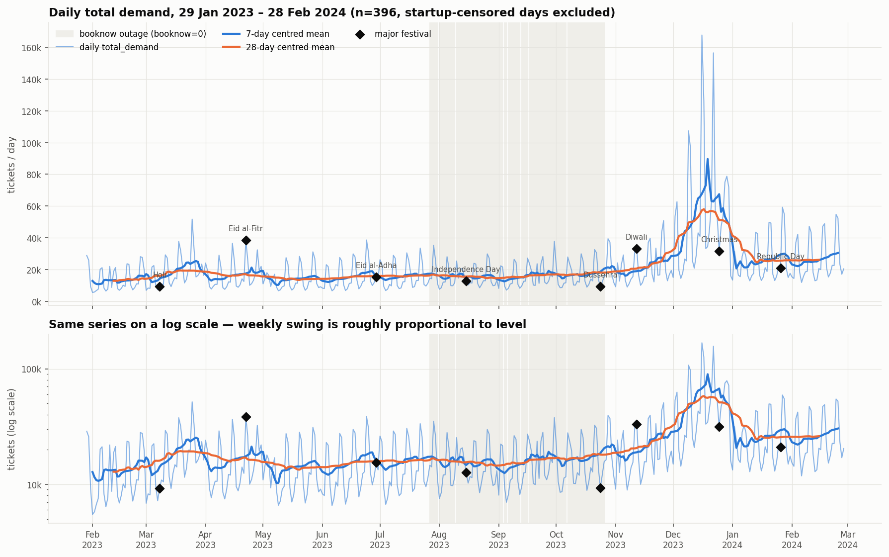
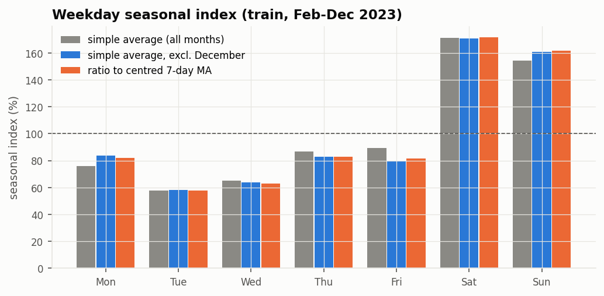
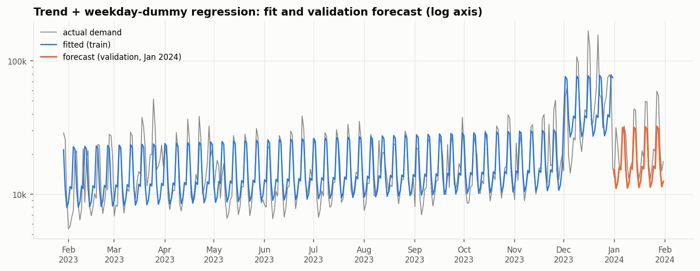
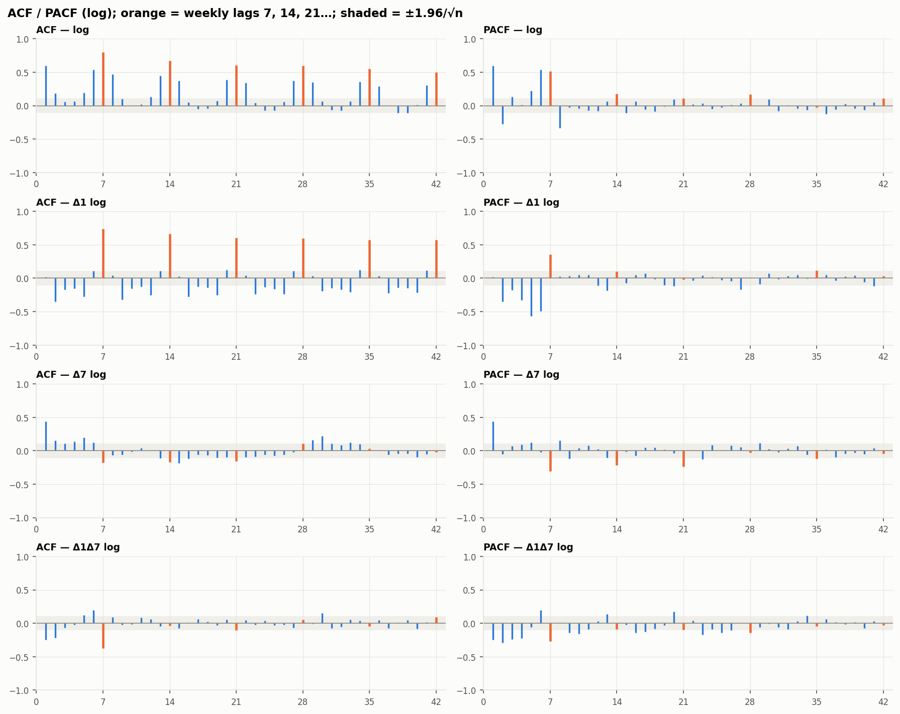
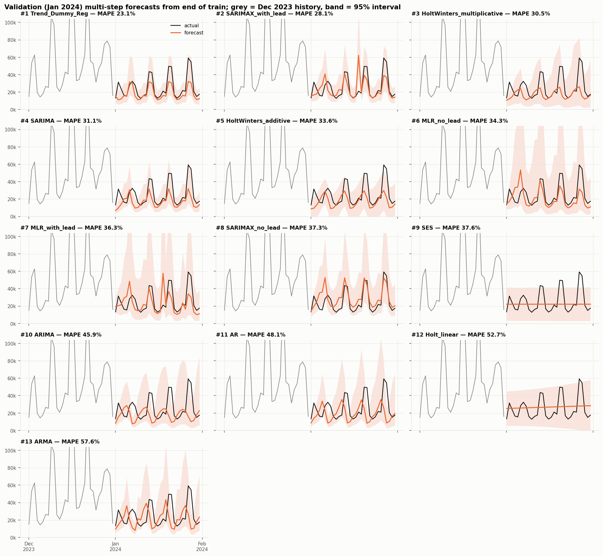
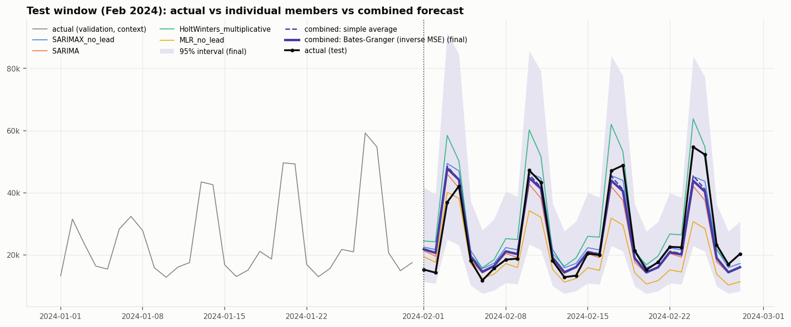
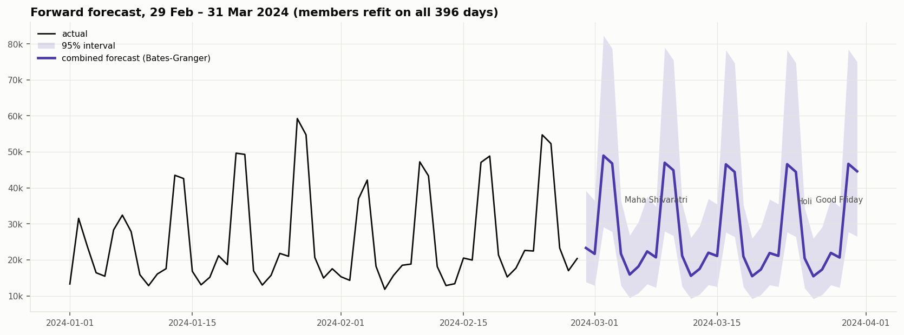

# Forecasting Cinema Audience Demand

*Time Series term project. Structured like the "Forecasting L&T Spare Parts" case: pattern → seasonal index → ANOVA → regression → exponential smoothing → stationarity & ARIMA → combining models → model comparison.*

All numbers come from `python run_pipeline.py --phase all`. The detailed tables are in `outputs/excel/`; the figures referenced below are in `outputs/figures/`.

---

## 1. Introduction

- A cinema ticketing business sells through two systems: **booknow** (online bookings) and **cinePOS** (box-office sales), across about 13,500 theaters.
- Screens, staff and concessions are planned days in advance, so the business needs a **daily forecast of total tickets**.
- The problem looks like the L&T case: demand has a **trend**, a strong **seasonal cycle** and **one-off events** (film releases, festivals, December holidays). The data also has quirks: an 84-day booknow outage and 11,335 tickets recorded in both systems.
- In L&T the season was the month (m = 12, monsoon overhauls). Here the season is the **day of the week (m = 7)**.

## 2. Data

| Item | Value |
|---|---|
| Series | daily `total_demand` = booknow booked + cinePOS sold − tickets recorded in both systems |
| Period modelled | 29 Jan 2023 – 28 Feb 2024 (396 days; first 28 days dropped because bookings made before the data start are missing) |
| Level | mean 20,759/day, median 15,442, min 5,487, max 167,804 |
| Split | **train** 29 Jan – 31 Dec 2023 (337 days) · **validation** Jan 2024 (31) · **test** Feb 2024 (28, kept sealed until the final comparison) |

## 3. Pattern

- **Trend:** level is flat from Feb to Oct 2023, climbs from November, peaks in December (a surge of about 2.5×), and settles about 70% above the 2023 level in Jan–Feb 2024. The STL trend rises +120% over the sample.
- **Seasonality:** strong weekly cycle. The periodogram peaks at 6.95 days (27% of power). Seasonal strength F_s = 0.76.
- **Multiplicative:** the weekly swing grows with the level (|additive residual| vs level r = 0.68), so all ARIMA-type models use **log demand**.
- **Irregular:** 61 outlier days (25 extreme). They are event-driven (Thursday/Friday releases, Christmas, New Year's Eve), not data errors.

## 4. Seasonal index (weekday)

Same method as the L&T slide: average demand for each season ÷ grand average. The columns are months instead of years.

| Weekday | Feb | Mar | … | Nov | Dec | Average | **Index** | Index excl. Dec | Ratio-to-MA index |
|---|---:|---:|---|---:|---:|---:|---:|---:|---:|
| Mon | 23,283 | 14,581 | … | 16,477 | 27,472 | 14,926 | **76.0%** | 83.8% | 81.9% |
| Tue | 11,358 | 11,036 | … | 10,991 | 29,147 | 11,309 | **57.6%** | 58.4% | 57.9% |
| Wed | 6,482 | 12,075 | … | 16,398 | 36,564 | 12,803 | **65.2%** | 63.9% | 63.1% |
| Thu | 7,479 | 15,409 | … | 17,905 | 51,903 | 17,012 | **86.6%** | 82.9% | 82.8% |
| Fri | 12,403 | 13,756 | … | 15,108 | 63,317 | 17,549 | **89.3%** | 79.5% | 81.4% |
| Sat | 9,107 | 35,018 | … | 33,896 | 91,328 | 33,623 | **171.2%** | 170.7% | 171.4% |
| Sun | 22,616 | 28,586 | … | 38,168 | 70,942 | 30,287 | **154.2%** | 160.7% | 161.5% |

**Saturday sells about 1.7× an average day and Tuesday about 0.58×.** The simple-average index is pulled around by December (for example, Friday reads 89% with December and 80% without). The ratio-to-moving-average index removes the trend first and agrees with the version that excludes December, so the weekday index is stable. Full table: `classical_analysis.xlsx → seasonal_index`.

## 5. ANOVA: is the weekday effect real?

| Analysis (train) | Source | SS | df | MS | F | p-value | F crit (5%) |
|---|---|---:|---:|---:|---:|---:|---:|
| One-way, tickets | Between weekdays | 2.40e10 | 6 | 4.00e9 | **14.70** | <0.001 | 2.13 |
| | Within | 8.98e10 | 330 | 2.72e8 | | | |
| One-way, log tickets | Between weekdays | 51.8 | 6 | 8.64 | **39.67** | <0.001 | 2.13 |
| Two-way, log (weekday + month) | Between weekdays | 49.7 | 6 | 8.29 | **78.30** | <0.001 | 2.13 |
| | Between months | 38.1 | 11 | 3.46 | 32.69 | <0.001 | 1.82 |
| Kruskal–Wallis (rank-based) | Between weekdays | | 6 | | χ² = 155.5 | <0.001 | 12.59 |

In the L&T case the one-way ANOVA across months was **not** significant (p = 0.376). The trend was hiding the seasonality inside the within-group variance, and it only showed once the regression added a trend term. The same mechanism is visible here: once the month-to-month level is taken out (two-way ANOVA), the weekday F-statistic **doubles from 39.7 to 78.3**. Unlike L&T, the weekly effect is strong enough to be significant even without that correction. The rank-based test confirms it is not driven by outliers.

## 6. Regression: trend + seasonal dummies

Model: `log demand = const + trend(months) + weekday dummies (Monday = base)`. OLS with HAC(7) standard errors, fitted on train, with December divided by the estimated surge multiplier of 2.50× (as for the other univariate models).

| Term | Full: coef | p | Reduced: coef | p | Multiplier (reduced) |
|---|---:|---:|---:|---:|---:|
| Intercept | 9.300 | <0.001 | 9.312 | <0.001 | |
| Trend (per month) | 0.030 | 0.003 | 0.030 | 0.003 | **+3.0%/month** |
| Tue | −0.324 | <0.001 | −0.336 | <0.001 | 0.72× Monday |
| Wed | −0.232 | 0.001 | −0.243 | <0.001 | 0.78× |
| Thu | 0.038 | 0.615 | — | | dropped |
| Fri | −0.003 | 0.966 | — | | dropped |
| Sat | 0.724 | <0.001 | 0.712 | <0.001 | **2.04×** |
| Sun | 0.676 | <0.001 | 0.665 | <0.001 | 1.94× |

| Regression statistics | Full | Reduced (p < 0.05) |
|---|---:|---:|
| Multiple R / R² / adj. R² | 0.769 / 0.592 / 0.583 | 0.769 / 0.591 / 0.585 |
| ANOVA F (df) | 68.1 (7, 329) | 95.7 (5, 331) |
| Significance F | <0.001 | <0.001 |
| Validation (Jan 2024) MAPE / RMSE | 23.1% / 10,147 | 23.2% / 10,145 |

As in L&T, dropping the insignificant dummies (here Thursday and Friday, which don't differ from Monday) gives a simpler model with the same fit and a higher F.

## 7. Simple exponential smoothing

- α = **0.036** (p = 0.035): a very long memory, so the forecast is a flat line at the smoothed level.
- In-sample MAPE is 52.8%, and the Ljung–Box Q(18) = 658 (p < 0.001): the residuals keep the whole weekly cycle.
- Validation MAPE is 37.6%. SES is the baseline, just as it was in the L&T deck.

Residual plot, ACF and Q-Q: `phase3_resid_SES.png`.

## 8. Stationarity: ACF/PACF and Augmented Dickey–Fuller

| Series (log demand) | ADF stat | ADF p | KPSS p | Conclusion |
|---|---:|---:|---:|---|
| level | −2.07 | 0.257 | ≤0.01 | **non-stationary** (both tests agree) |
| Δ1 (first difference) | −6.37 | <0.001 | 0.047 | borderline (KPSS still rejects) |
| Δ7 (seasonal difference) | −6.32 | <0.001 | ≥0.10 | **stationary** |
| Δ1Δ7 | −7.66 | <0.001 | ≥0.10 | stationary, but ACF shows over-differencing |

L&T needed a first difference (ADF p 0.31 → 0.012). Here the ACF of Δ1 log demand still shows spikes of about 0.6–0.7 at lags 7, 14, … 42, so the right difference is the **seasonal difference (D = 1, d = 0)**.

## 9. Holt-Winters

| | Additive | Multiplicative |
|---|---:|---:|
| α (level) | 0.203 | 0.317 |
| β (trend) | 0.001 | 0.000 |
| γ (season) | 0.302 | 0.423 |
| In-sample MAPE | 26.7% | 24.8% |
| Ljung–Box Q(18) sig. | <0.001 | **0.228** (white noise) |
| Validation MAPE | 33.6% | 30.5% |

As in L&T (γ_trend ≈ 0), the **trend smoothing weight is essentially zero**: the model keeps a fixed slope. The multiplicative version leaves white-noise residuals, but it carries a one-day spike into the next day's fit (22 Dec 2023: 157k actual → 278k fitted for 23 Dec), which inflates its in-sample MaxAE.

## 10. ARIMA

The L&T deck compared the auto-ARIMA suggestion with hand-identified orders. We did the same:

| Candidate | How chosen | AIC (log) | Ljung–Box | Validation MAPE |
|---|---|---:|---|---:|
| ARIMA(7,1,1) + drift | `auto_arima`, non-seasonal, KPSS → d = 1 | 181.5 | Q(18) p = 0.001 | 45.9% |
| AR(7) / ARMA(7,3) on Δ7 log | AIC grid on the stationary series | — | p < 0.001 | 48.1% / 57.6% |
| **SARIMA(1,0,0)(1,1,1)₇** | identified from ACF/PACF (AR(1) + seasonal MA(1)), grid-refined | **133.9** | Q(18) p = 0.053 | **31.1%** |
| SARIMAX(1,1,1)(1,0,0)₇ + weekday/holiday/December regressors | AIC grid | 127.3 | Q(18) p = 0.479 | 37.3% (lowest val RMSE 9,284) |

The auto-ARIMA fit needs 7 AR lags to imitate the weekly cycle and still leaves autocorrelation. The seasonal model identified from the ACF/PACF is smaller, has a much lower AIC and forecasts better. That is the same lesson as L&T, where the auto suggestion ARIMA(0,0,1) was overruled by the ADF test (difference needed), and the identified ARIMA(2,1,0) had the cleanest residuals (Ljung–Box p = 0.93). SARIMA coefficients: φ₁ = 0.44, Φ₁ = 0.31, Θ₁ = −0.86 (all p < 0.001).

## 11. Combining models

Members (fixed on validation, before looking at test): SARIMAX_no_lead, SARIMA, Holt-Winters multiplicative, MLR_no_lead.

| Method | Weights (SARIMAX / SARIMA / HW-mult / MLR) | Intercept | Test RMSE | Test MAPE |
|---|---|---:|---:|---:|
| **Regression with intercept** (L&T slide 28) | 1.04 / 1.70 / −1.82 / −0.71 | 11,873 | 24,986 | 46.1% |
| **Regression without intercept, sum-to-one** (L&T slides 29–30) | 0.86 / 1.84 / −1.04 / −0.66 | 0 | 8,617 | 18.0% |
| Bates–Granger (inverse-MSE) — *chosen before test* | 0.40 / 0.21 / 0.15 / 0.24 | 0 | 4,800 | 14.1% |
| Simple average | 0.25 each | 0 | 4,601 | **13.8%** |

The L&T regression combinations fitted and forecast on the same 48 months (R² = 0.987 without intercept). Here the weights were estimated on validation and scored on the unseen test month. That exposes the problem the L&T slides hint at (Winters weight 0.87 with t = 2.6, the other members insignificant): **the member forecasts are highly collinear (VIF up to 84), so the regression weights take opposite signs and extrapolate badly**. The regression with intercept is significantly worse than the best single model (Diebold–Mariano p = 0.005). Simple and inverse-MSE weights are the robust choice.

## 12. Model comparison

SPSS-style fit statistics on the **training** window (ticket scale; stationary R² is measured against a seasonal random walk), then out-of-sample accuracy. Full table for all 13 models: `classical_analysis.xlsx → fit_statistics_all_models`.

| | Trend+dummy Reg | SES | HW mult. | ARIMA(7,1,1) | SARIMA | SARIMAX | Combined (Bates–Granger) |
|---|---:|---:|---:|---:|---:|---:|---:|
| Stationary R² | 0.228 | −0.211 | −0.650 | −0.090 | 0.029 | 0.103 | — |
| R² | 0.591 | 0.359 | 0.132 | 0.426 | 0.488 | 0.528 | — |
| RMSE | 11,749 | 14,715 | 17,122 | 13,954 | 13,244 | 12,652 | — |
| MAPE (%) | 24.4 | 52.8 | 24.8 | 23.9 | 20.5 | 20.3 | — |
| MaxAPE (%) | 368 | 256 | 426 | 326 | 327 | 321 | — |
| MAE | 5,346 | 9,128 | 5,581 | 5,261 | 4,794 | 4,689 | — |
| MaxAE | 118,939 | 121,251 | 221,875 | 181,832 | 160,762 | 142,174 | — |
| Normalised BIC | 18.88 | 19.23 | 19.70 | 19.26 | 19.05 | 19.12 | — |
| Ljung–Box Q(18) sig. | <0.001 | <0.001 | 0.228 | 0.001 | 0.053 | 0.479 | — |
| **Validation MAPE (Jan)** | **23.1** | 37.6 | 30.5 | 45.9 | 31.1 | 37.3 | — |
| **Test RMSE (Feb)** | 6,642 | 13,584 | 7,439 | 7,859 | 5,442 | **4,584** | 4,800 |
| **Test MAPE (Feb)** | 15.4 | 46.4 | 23.3 | 27.9 | 14.3 | 15.2 | 14.1 |

## 13. Conclusions

1. **Seasonality is weekly and multiplicative.** Saturday is about 2× Monday and Tuesday about 0.7×. The seasonal index, ANOVA (F = 14.7 → 78.3 once the level is removed) and the dummy regression all agree.
2. **The trend is weak outside December** (+3%/month). December 2023 is a temporary surge, handled with a dummy or an adjustment rather than extrapolated.
3. **The simple trend + dummy regression holds up well.** It had the best validation MAPE of all 13 models, and in the L&T deck the regression also stayed close to Winters. Models that model the autocorrelation (SARIMA/SARIMAX) have cleaner residuals and win on the test month.
4. **Combining forecasts:** the regression-based weights from the L&T deck overfit when scored out of sample. Simple-average and Bates–Granger combinations are statistically tied with the best single model (DM p > 0.7) and are the safer choice. **Recommended forecast: Bates–Granger combination** (test MAPE 14.1%), with SARIMAX_no_lead as the single-model fallback.
5. **Beyond the L&T scope:** survival analysis of theaters (`phase5_*`) shows 95.3% are still active after one year. booknow theaters have about 9× the closure hazard.

*Limitations:* 13 months of data, so annual seasonality and a "normal" December cannot be estimated. Release dates are not in the files, so the spikes stay unexplained. The validation month (January) is the post-December settling period.
